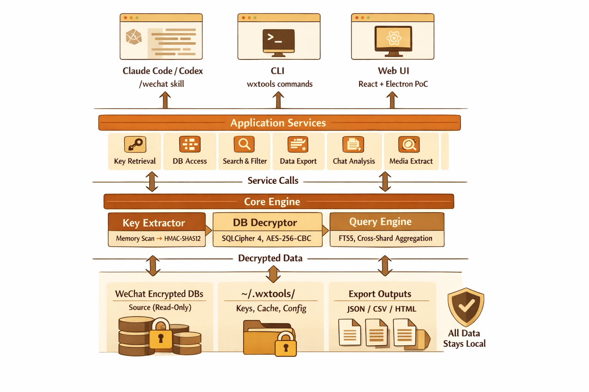
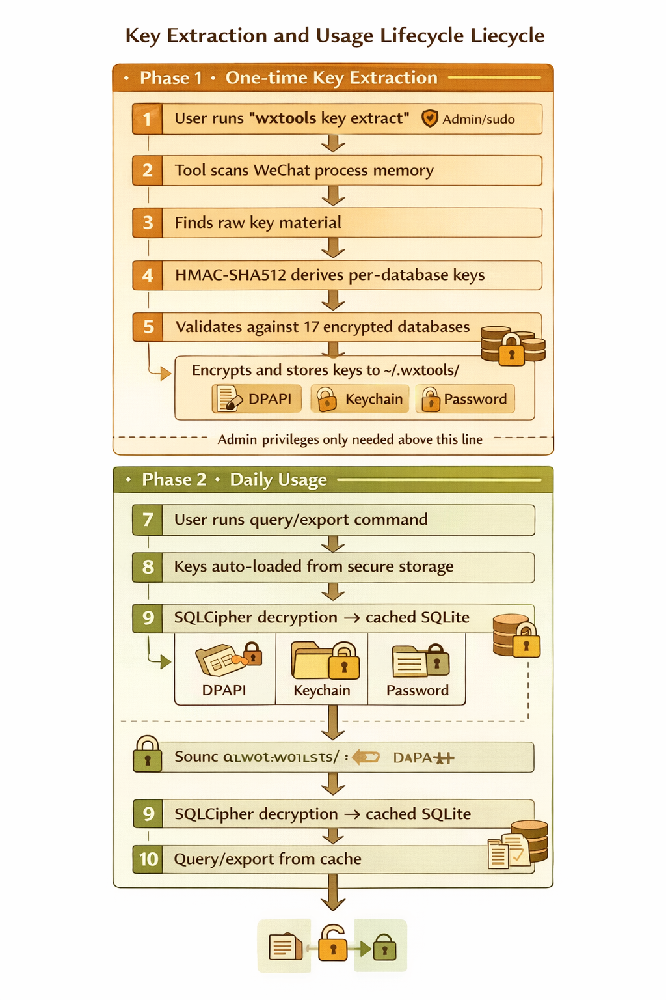
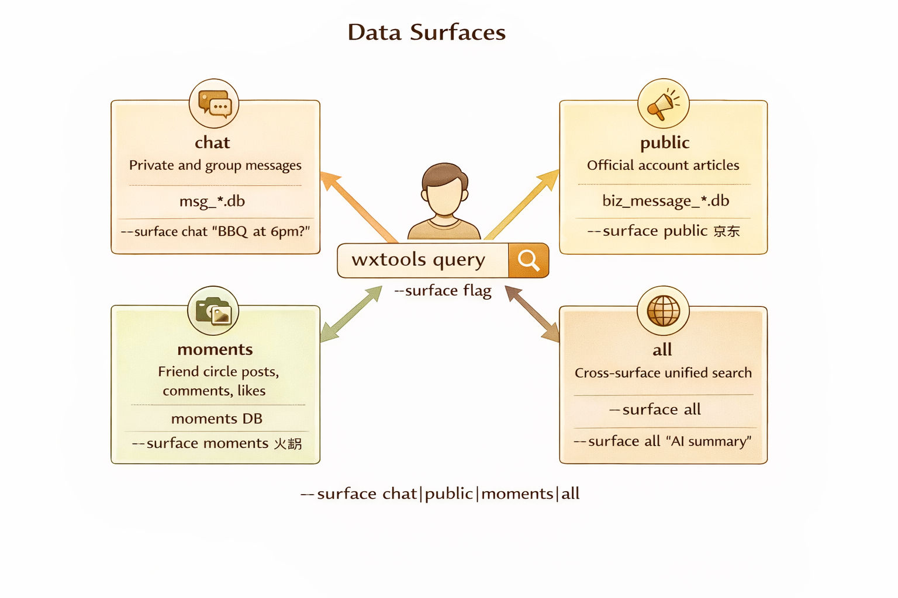
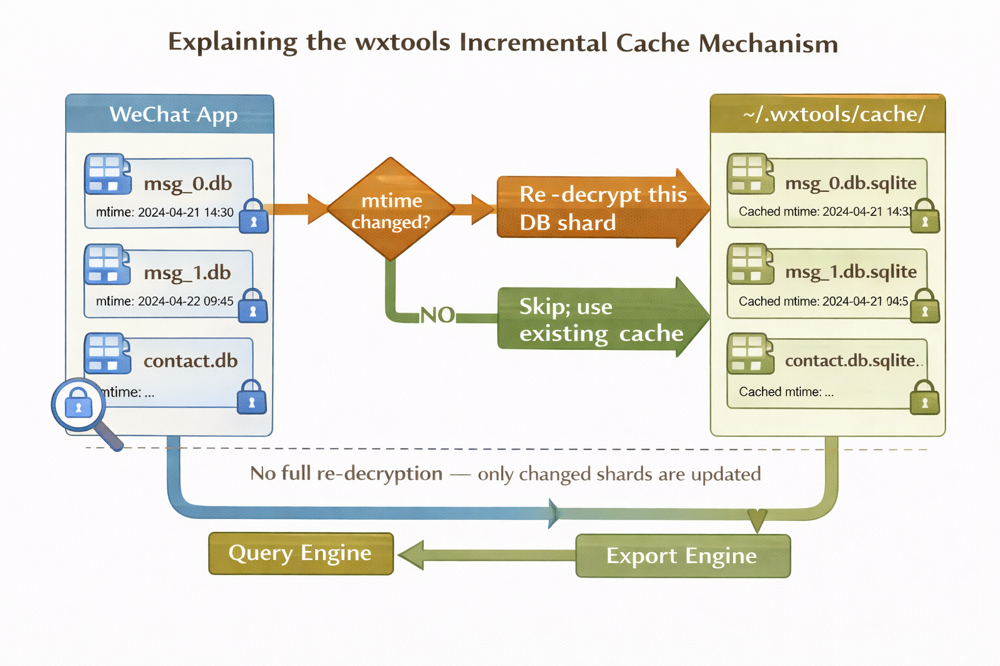
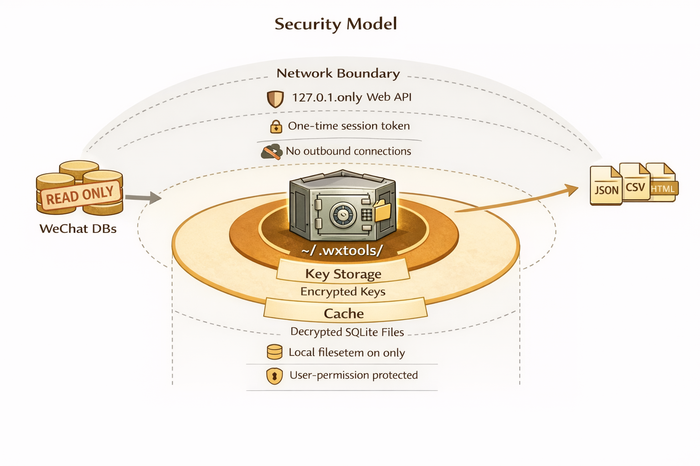

# wxtools — WeChat Chat History Decryption & Analysis Toolkit

> **Current version: v0.6.0** | Python 3.9+ | Windows / macOS / Linux | MIT License

Local-first toolkit for decrypting WeChat PC (4.x / 3.x) SQLCipher-encrypted databases. Keyword search, full-text retrieval, contact/date filtering, and export to JSON / CSV / HTML (chat bubble UI). Supports Official Account messages and Moments. **All data stays local.**

**Talk to your data in natural language** — built-in `/wechat` skill for Claude Code and Codex, no commands to memorize.

<p align="center">
  
</p>

---

## Table of Contents

- [Features](#features)
- [Cross-Platform Support](#cross-platform-support)
- [Installation](#installation)
- [Quick Start (First-Time User)](#quick-start-first-time-user)
- [AI Skill — Natural Language Interface](#ai-skill--natural-language-interface)
- [Data Surfaces](#data-surfaces)
- [Cache & Incremental Sync](#cache--incremental-sync)
- [Security Model](#security-model)
- [Command Reference](#command-reference)
- [GUI & Desktop App](#gui--desktop-app)
- [REST API](#rest-api)
- [Architecture](#architecture)
- [Development](#development)
- [Version History](#version-history)
- [FAQ](#faq)
- [License](#license)

---

## Features

| Category | Highlights |
|----------|-----------|
| **Key Extraction** | One-time memory scan, HMAC-SHA512 per-DB key derivation, secure storage (DPAPI / Keychain / password) |
| **Decryption** | SQLCipher 4 AES-256-CBC, incremental shard-level cache, automatic new-message sync |
| **Query** | Keyword, contact, conversation, date range, message type; FTS5 full-text with CJK optimization |
| **Export** | JSON / CSV / HTML (chat bubble UI), browser download (.zip), attachment resolve / check / copy |
| **Data Surfaces** | Chat, Official Accounts, Moments, cross-surface unified search |
| **AI Skill** | `/wechat` for Claude Code & Codex — natural language to CLI, auto error recovery |
| **Web UI** | React SPA with search center, workspace, export wizard; FastAPI backend with typed API envelope |
| **Desktop App** | Electron shell with bundled Python backend, first-run onboarding wizard |
| **Dual-Track** | CLI + skill for developers; Desktop app for non-technical users — shared core, separate entry points |

---

## Cross-Platform Support

| Capability | Windows | macOS | Linux (Wine) |
|------------|---------|-------|--------------|
| Key extraction (`key extract`) | Yes | Yes (sudo) | — |
| Key import (`key set`) | Yes | Yes | Yes |
| Query / Export | Yes | Yes | Yes |
| Data dir auto-discovery | Yes | Yes | Yes (Wine) |
| Key protection | DPAPI | Keychain | Secret Service |
| Fallback protection | Password | Password | Password |

---

## Installation

### For CLI / Developer Users

```bash
git clone https://github.com/SensLiao/Wechat-Archive-Analyzer.git
cd Wechat-Archive-Analyzer
pip install -e .
pip install pycryptodome   # AES decryption dependency
```

**Requirements:** Python 3.9+. Key extraction on Windows and macOS; key import, query, and export on all platforms.

> **CJK path note:** On Chinese Windows / Anaconda where the project path contains non-ASCII characters, use `python -X utf8 -m wxtools ...` to avoid GBK encoding issues.

### For Desktop Users (No Python Required)

> Coming soon — the Electron desktop app will ship as a standalone installer with a bundled Python backend. No Python installation needed.

---

## Quick Start (First-Time User)

wxtools has three ways to interact with your WeChat data. Choose whichever fits your style:

| Method | Best For | What You Need |
|--------|----------|---------------|
| **CLI** (`wxtools` commands) | Power users, scripting | Python + terminal |
| **Web UI** (`wxtools app start`) | Visual browsing, anyone comfortable with a browser | Python + browser |
| **AI Skill** (`/wechat` in Claude Code) | Natural language, zero learning curve | Python + Claude Code |

### Step 1: Extract Key (one-time, all methods need this)

<p align="center">
  
</p>

**Windows / macOS (auto-extract):**

```bash
wxtools key extract   # Windows: admin required; macOS: sudo; WeChat must be running
```

This scans WeChat process memory, derives per-database keys via HMAC-SHA512, validates against encrypted databases, and stores keys to `~/.wxtools/keys/`. First run prompts for optional password protection; otherwise uses system keystore (DPAPI / Keychain).

**The key is permanent — extract once, use forever.** All subsequent operations need no admin privileges.

**Linux (manual import):**

```bash
wxtools key set <64-char-hex-key-or-json-file>
```

### Step 2: Choose Your Interface

#### Option A: CLI

```bash
# Search messages
wxtools query "keyword"
wxtools query --contact "Alice" --since 2026-01-01
wxtools query --conversation "Work Group" --type image --limit 50

# Export
wxtools export --contact "Alice" -o ./output/
wxtools export --format html --contact "Alice" -o ./output/   # Chat bubble UI
wxtools export --format csv --conversation "Work Group" -o ./output/
wxtools export --attachments copy -o ./output/   # Include attachment files
```

First query auto-decrypts databases and builds cache. Subsequent queries detect new messages and incrementally update only changed shards.

#### Option B: Web UI

```bash
wxtools app start   # Opens browser at http://127.0.0.1:8808
```

Five pages available:

| Page | What You Can Do |
|------|-----------------|
| **Home** | See account overview, key status, cache stats, quick actions |
| **Search Center** | Keyword + faceted filters (contact / group / date / type / surface) |
| **Workspace** | Collect materials across surfaces, add tags and notes |
| **Export Wizard** | 4-step guided export: source → template → format → browser download (.zip) |
| **Settings** | Account management, key operations, cache control |

#### Option C: AI Skill (Claude Code / Codex)

```bash
# Install the skill first
python -X utf8 -m wxtools install-skill
# For Codex: python -X utf8 -m wxtools install-skill --codex
```

Then in Claude Code, just talk naturally:

```
/wechat extract my WeChat key
/wechat find messages from Alice last week about the project
/wechat export chat with Bob from the past month in HTML
/wechat search "weekly report" in Work Group
/wechat check official account messages mentioning AI
/wechat how much space does the cache use
```

The agent automatically checks environment, translates to CLI commands, handles errors, and asks for confirmation before large exports.

---

## Data Surfaces

<p align="center">
  
</p>

wxtools organizes WeChat data into 4 queryable surfaces:

| Surface | Source DBs | Description |
|---------|-----------|-------------|
| `chat` | `msg_*.db` | Private and group messages (default) |
| `public` | `biz_message_*.db` | Official Account articles |
| `moments` | moments DB | Friend Circle posts, comments, likes |
| `all` | all of the above | Cross-surface unified search |

```bash
wxtools query --surface public "AI"                    # Official Account messages
wxtools query --surface moments --contact "Alice"      # Alice's Moments
wxtools query --surface all "keyword"                  # Search everywhere
```

---

## Cache & Incremental Sync

<p align="center">
  
</p>

- Decrypted SQLite files are cached in `~/.wxtools/cache/<wxid>/`
- Before each query/export, source DB `mtime` is compared against cache
- **Only changed shards are re-decrypted** — no full re-decryption needed
- New WeChat messages update source DB mtime, triggering automatic incremental sync on next query
- Manual control: `wxtools cache status` / `wxtools cache clear`

---

## Security Model

<p align="center">
  
</p>

| Layer | Protection |
|-------|-----------|
| **Key Storage** | System keystore (DPAPI / Keychain / Secret Service) or password-encrypted (Fernet + scrypt) |
| **Cache** | Local filesystem only, user-permission protected |
| **Network** | Web API binds `127.0.0.1` only, one-time session token, no outbound connections |
| **Source DBs** | Read-only access — wxtools never modifies WeChat databases |
| **Exports** | Browser download (.zip) in Web UI; CLI writes to local filesystem |
| **API Responses** | Typed `ApiEnvelope` wrapper with error codes, no sensitive data in error messages |

Admin/sudo privileges are **only** needed for `key extract` (process memory reading). All other operations run as normal user.

---

## Command Reference

| Command | Purpose |
|---------|---------|
| `wxtools key extract` | Extract key from WeChat process (one-time, admin required) |
| `wxtools key status` | View key status for all discovered accounts |
| `wxtools key verify` | Validate stored key against encrypted databases |
| `wxtools key set <hex/file>` | Manually import key |
| `wxtools key set-password` | Set password protection for stored keys |
| `wxtools key remove-password` | Remove password, revert to system keystore |
| `wxtools key unlock` | Unlock session (cache decrypted key in memory) |
| `wxtools key lock [--all]` | Lock session |
| `wxtools query "keyword"` | Search messages with filters |
| `wxtools export` | Export chat records (JSON/CSV/HTML) |
| `wxtools cache status` | View cache stats |
| `wxtools cache clear` | Clear decrypted cache |
| `wxtools cache build-index` | Build FTS5 full-text index |
| `wxtools cache drop-index` | Drop FTS index |
| `wxtools config show` | View current configuration |
| `wxtools config set <key> <value>` | Modify configuration |
| `wxtools app start` | Launch Web UI (API + frontend) |

All commands support `--json` for structured output, `-v` / `-vv` for debug logs, `--password` for non-interactive password input.

---

## GUI & Desktop App

### Web UI (Available Now)

```bash
wxtools app start                     # Launch, auto-open browser
wxtools app start --port 9000         # Custom port
wxtools app start --no-open           # Don't auto-open browser
```

FastAPI backend + React frontend at `127.0.0.1:8808`. Session token injected server-side into every page load — survives refreshes and server restarts. Port auto-reclaimed if a previous instance didn't shut down cleanly.

### Desktop App (Electron)

The desktop app wraps the same Web UI in an Electron shell with:
- **Bundled Python backend** — no Python installation required for end users
- **First-run onboarding wizard** — step-by-step guide: detect WeChat → detect accounts → extract key → verify → start using
- **Auto-port selection** — picks a free port, manages backend lifecycle
- **Standalone installer** — NSIS installer for Windows

**Development mode:**

```bash
cd desktop
npm install
npm start
```

**Building the installer:**

```bash
cd desktop
python scripts/build.py    # Builds frontend + backend + installer
```

See [`desktop/README.md`](desktop/README.md) for detailed build instructions.

---

## REST API

API binds `127.0.0.1` only. All responses use the `ApiEnvelope` format:

```json
{
  "ok": true,
  "data": { ... },
  "error": null
}
```

On error:

```json
{
  "ok": false,
  "data": null,
  "error": {
    "code": "KEY_NOT_FOUND",
    "message": "No key stored for this account",
    "remediation": "Run wxtools key extract first"
  }
}
```

Protected endpoints require `X-Session-Token` header.

| Method | Path | Description |
|--------|------|-------------|
| GET | `/api/health` | Health check (no auth) |
| GET | `/api/accounts` | Account list |
| GET | `/api/home/summary` | Home page aggregate data |
| GET | `/api/key/status` | Key status |
| POST | `/api/key/extract` | Extract key |
| POST | `/api/key/verify` | Verify key |
| GET | `/api/cache/status` | Cache status |
| POST | `/api/query/search` | Search messages |
| POST | `/api/query/context` | Get message context |
| GET | `/api/workspaces` | Workspace list |
| POST | `/api/workspaces` | Create workspace |
| GET/DELETE | `/api/workspaces/{id}` | Get/delete workspace |
| GET | `/api/export/templates` | Export template list |
| POST | `/api/export` | Execute export (returns `download_id` for browser download) |
| GET | `/api/export/download/{id}` | Download exported .zip file (token via query param) |
| GET | `/api/onboarding/status` | First-run onboarding status |
| POST | `/api/onboarding/extract-key` | Trigger key extraction (onboarding) |
| POST | `/api/onboarding/verify` | Verify key (onboarding) |
| GET | `/api/docs` | Swagger UI (interactive API docs) |

---

## Architecture

V6 uses a **DDD-inspired layered architecture** with strict one-way dependencies:

```
src/wxtools/
├── domain/              Core models (Message, Contact, etc.) and error hierarchy
├── runtime/             Config, logging, platform detection, bootstrap, app host
├── infrastructure/
│   ├── wechat/          WeChat data access (key extraction, decryption, DB reading)
│   ├── secrets/         Key storage backends (DPAPI, Keychain, password file)
│   ├── storage/         ACL, filesystem operations
│   └── exporters/       JSON / CSV / HTML writers
├── application/         Business services (shared by all interfaces)
├── interfaces/
│   ├── cli/             Click CLI (thin adapter)
│   ├── api/             FastAPI REST API (thin adapter)
│   └── desktop/         Electron backend entry point
└── adapters/            AI agent skill templates
```

**Dependency direction:**

```
interfaces/cli/  ──┐
interfaces/api/  ──┼──→ application/ ──→ infrastructure/ ──→ domain/
interfaces/desktop/┘
```

**Dual-track strategy:**
- `main` branch: public CLI + skill + shared core (open source)
- `desktop-local` branch: private Electron app for non-technical users

---

## Development

### Setup

```bash
git clone https://github.com/SensLiao/Wechat-Archive-Analyzer.git
cd Wechat-Archive-Analyzer
pip install -e ".[dev]"
```

### Run Tests

```bash
python -X utf8 -m pytest tests/ -q     # 221 tests
```

### Build Web Frontend

```bash
cd web
npm install
npm run build    # Output to web/dist/
npm run dev      # Dev mode (Vite, HMR)
```

### Project Commands

```bash
wxtools --version         # Check version
wxtools --help            # All commands
python -X utf8 -m wxtools # Alternative invocation for CJK paths
```

---

## Version History

### v0.6.0 — Dual-Track Architecture (current)

Major restructuring for long-term maintainability and desktop app delivery.

| Feature | Details |
|---------|---------|
| **DDD layered architecture** | `domain/` → `runtime/` → `infrastructure/` → `application/` → `interfaces/` — strict one-way dependencies |
| **Plugin system removed** | Single data source (WeChat), no unnecessary abstraction |
| **ApiEnvelope response model** | All API routes return typed `{"ok", "data", "error"}` envelope |
| **Desktop runtime** | `paths.py` (mode-aware), `bootstrap.py` (shared init), `app_host.py` (server lifecycle) |
| **Onboarding flow** | Service + API endpoints for first-run wizard (detect → extract → verify → ready) |
| **Electron build pipeline** | PyInstaller spec + build script + electron-builder config for standalone installer |
| **221 tests** | 43 new tests for API contracts, paths, bootstrap, onboarding |

### v0.5.0 — Local Information Workbench

Full GUI interface with React SPA + FastAPI backend (19 endpoints). Search center, workspace, export wizard, Electron PoC.

### v0.4.1 — E2E Validation & Fixes

Fixed `key verify` on Windows, `cache build-index` for 4.x, Windows GBK terminal crash.

### v0.4.0 — Cross-Platform

Key protection abstraction (DPAPI / Keychain / Secret Service / password). macOS key extraction via Mach VM API.

### v0.3.0 — Data Surfaces & CI

Surface switching (chat / public / moments / all). Official Accounts and Moments support. GitHub Actions CI.

### v0.2.0 — Query & Export Enhancement

Key verification, session unlock, FTS5 full-text search, CSV/HTML export, attachments, pagination.

### v0.1.0 — Core Engine

Key extraction, SQLCipher 4 decryption, keyword search, JSON export, config, AI skill.

---

## FAQ

**Do I need admin privileges?**
Only for `key extract` (reads WeChat process memory). After extracting once, everything else runs as normal user.

**Do I need to re-extract the key?**
No. The key is permanent unless WeChat changes its encryption scheme in a major update.

**How are new messages synced?**
Automatically. Each query checks source DB modification time and re-decrypts only updated shards.

**Can't find the database?**
```bash
wxtools config set wechat_data_dir "C:\Users\YourName\Documents\xwechat_files"
```

**Multiple accounts?**
```bash
wxtools key status                          # List all accounts
wxtools query "keyword" --account wxid_xxx  # Query specific account
wxtools config set active_account wxid_xxx  # Set default account
```

**Chinese Windows path issues?**
```bash
python -X utf8 -m wxtools query "keyword"   # Use -X utf8 flag
```

---

## License

MIT
