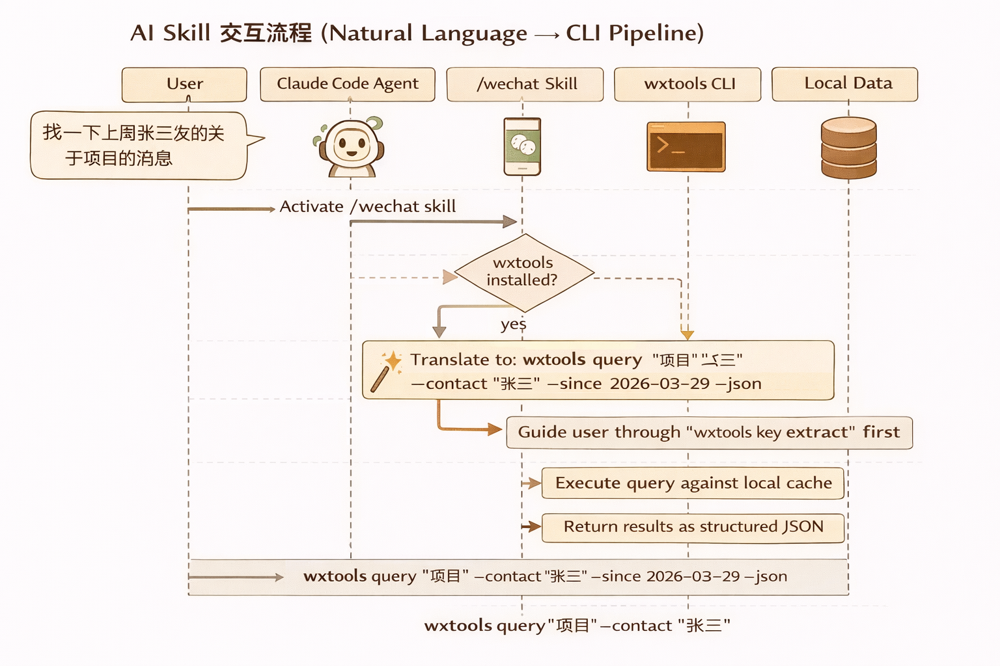

# wxtools — WeChat Chat History Decryption & Analysis Toolkit

> **Current version: v0.5.0** | Python 3.9+ | Windows / macOS / Linux | MIT License

Local-first toolkit for decrypting WeChat PC (4.x / 3.x) SQLCipher-encrypted databases. Keyword search, full-text retrieval, contact/date filtering, and export to JSON / CSV / HTML (chat bubble UI). Supports Official Account messages and Moments. **All data stays local.**

**Talk to your data in natural language** — built-in `/wechat` skill for Claude Code and Codex, no commands to memorize.

<p align="center">
  
</p>

---

## Table of Contents

- [Features](#features)
- [Cross-Platform Support](#cross-platform-support)
- [Installation](#installation)
- [Quick Start](#quick-start)
- [AI Skill — Natural Language Interface](#ai-skill--natural-language-interface)
- [Data Surfaces](#data-surfaces)
- [Cache & Incremental Sync](#cache--incremental-sync)
- [Security Model](#security-model)
- [Command Reference](#command-reference)
- [GUI & Desktop App](#gui--desktop-app-v050)
- [REST API](#rest-api)
- [Version History](#version-history)
- [License](#license)

---

## Features

| Category | Highlights |
|----------|-----------|
| Key Extraction | One-time memory scan, HMAC-SHA512 per-DB key derivation, secure storage (DPAPI / Keychain / password) |
| Decryption | SQLCipher 4 AES-256-CBC, incremental shard-level cache, automatic new-message sync |
| Query | Keyword, contact, conversation, date range, message type; FTS5 full-text with CJK optimization |
| Export | JSON / CSV / HTML (chat bubble UI), attachment resolve / check / copy |
| Data Surfaces | Chat, Official Accounts, Moments, cross-surface unified search |
| AI Skill | `/wechat` for Claude Code & Codex — natural language to CLI, auto error recovery |
| Web UI | React SPA with search center, workspace, export wizard; FastAPI backend (19 endpoints) |
| Desktop | Electron PoC with Python sidecar |

---

## Cross-Platform Support

| Capability | Windows | macOS | Linux (Wine) |
|------------|---------|-------|--------------|
| Key extraction (`key extract`) | Yes | Yes (sudo) | — |
| Key import (`key set`) | Yes | Yes | Yes |
| Query / Export | Yes | Yes | Yes |
| Data dir auto-discovery | Yes | Yes | Yes (Wine) |
| Key protection | DPAPI | Keychain | Secret Service |
| Fallback protection | Password | Password | Password |

---

## Installation

```bash
git clone https://github.com/SensLiao/Wechat-Archive-Analyzer.git
cd Wechat-Archive-Analyzer
pip install -e .
pip install pycryptodome   # AES decryption dependency
```

**Requirements:** Python 3.9+. Key extraction on Windows and macOS; key import, query, and export on all platforms.

> **CJK path note:** On Chinese Windows / Anaconda where the project path contains non-ASCII characters, use `python -X utf8 -m wxtools ...` to avoid GBK encoding issues.

---

## Quick Start

> **Tip:** With Claude Code or Codex, just say `/wechat help me extract the key` and the agent will guide you through everything below.

### 1. Extract Key (one-time)

<p align="center">
  
</p>

**Windows / macOS (auto-extract):**

```bash
wxtools key extract   # Windows: admin required; macOS: sudo; WeChat must be running
```

Scans WeChat process memory, derives per-database keys via HMAC-SHA512, validates against 17 encrypted databases, and stores encrypted keys to `~/.wxtools/keys/`. First run prompts for optional password protection; otherwise uses system keystore (DPAPI / Keychain).

**The key is permanent — extract once, use forever.** Subsequent query/export needs no admin privileges.

**Linux (manual import):**

```bash
wxtools key set <64-char-hex-key-or-json-file>
```

### 2. Query

```bash
wxtools query "keyword"
wxtools query --contact "Alice" --since 2026-01-01
wxtools query --conversation "Work Group" --type image --limit 50
```

First query auto-decrypts databases and builds cache. Subsequent queries detect new messages and incrementally update only changed shards.

### 3. Export

```bash
wxtools export --contact "Alice" -o ./output/
wxtools export --format html --contact "Alice" -o ./output/   # Chat bubble UI
wxtools export --format csv --conversation "Work Group" -o ./output/
wxtools export --attachments copy -o ./output/   # Include attachment files
```

Supports JSON (default), CSV, HTML. Over 1000 messages requires confirmation (or `--yes` to skip). `--attachments` modes: `path` (resolve paths), `check` (verify existence), `copy` (copy to export dir).

---

## AI Skill — Natural Language Interface

<p align="center">
  
</p>

Install the skill, then talk to your data in plain language — the agent translates to precise CLI commands automatically.

### Install Skill

```bash
# Claude Code
python -X utf8 -m wxtools install-skill

# Codex
python -X utf8 -m wxtools install-skill --codex
```

### Example Conversations

```
/wechat extract my WeChat key
/wechat find messages from Alice last week about the project
/wechat export chat with Bob from the past month in HTML
/wechat search "weekly report" in Work Group
/wechat check official account messages mentioning AI
/wechat export Alice's Moments
/wechat key status
/wechat how much space does the cache use
```

The agent automatically:
- Checks environment (wxtools installed? key ready?)
- Translates natural language to exact CLI commands
- Handles password unlock, incremental cache, format selection
- Retries on error with fix suggestions
- Asks for confirmation before large exports

> **Privacy:** All decryption and queries happen locally. The CLI never phones home. The AI agent may use cloud inference for your natural language request, but raw chat records are not uploaded.

---

## Data Surfaces

<p align="center">
  
</p>

wxtools organizes WeChat data into 4 queryable surfaces:

| Surface | Source DBs | Description |
|---------|-----------|-------------|
| `chat` | `msg_*.db` | Private and group messages (default) |
| `public` | `biz_message_*.db` | Official Account articles |
| `moments` | moments DB | Friend Circle posts, comments, likes |
| `all` | all of the above | Cross-surface unified search |

```bash
wxtools query --surface public "AI"                    # Official Account messages
wxtools query --surface moments --contact "Alice"      # Alice's Moments
wxtools query --surface all "keyword"                  # Search everywhere
```

---

## Cache & Incremental Sync

<p align="center">
  
</p>

- Decrypted SQLite files are cached in `~/.wxtools/cache/<wxid>/`
- Before each query/export, source DB `mtime` is compared against cache
- **Only changed shards are re-decrypted** — no full re-decryption needed
- New WeChat messages update source DB mtime, triggering automatic incremental sync on next query
- Manual control: `wxtools cache status` / `wxtools cache clear`

---

## Security Model

<p align="center">
  
</p>

| Layer | Protection |
|-------|-----------|
| **Key Storage** | System keystore (DPAPI / Keychain / Secret Service) or password-encrypted (Fernet + scrypt) |
| **Cache** | Local filesystem only, user-permission protected |
| **Network** | Web API binds `127.0.0.1` only, one-time session token, no outbound connections |
| **Source DBs** | Read-only access — wxtools never modifies WeChat databases |
| **Exports** | Output to local filesystem only |

Admin/sudo privileges are **only** needed for `key extract` (process memory reading). All other operations run as normal user.

---

## Command Reference

| Command | Purpose |
|---------|---------|
| `wxtools key extract` | Extract key (one-time) |
| `wxtools key status` | View key status |
| `wxtools key verify` | Validate key against DBs |
| `wxtools key set <hex/file>` | Manually import key |
| `wxtools key set-password` | Set password protection |
| `wxtools key remove-password` | Remove password, revert to system keystore |
| `wxtools key unlock` | Unlock session (cache key in memory) |
| `wxtools key lock [--all]` | Lock session |
| `wxtools query "keyword"` | Search messages |
| `wxtools export` | Export chat records (JSON/CSV/HTML) |
| `wxtools cache status` | View cache status |
| `wxtools cache clear` | Clear cache |
| `wxtools cache build-index` | Build FTS full-text index |
| `wxtools cache drop-index` | Drop FTS index |
| `wxtools config show` | View config |
| `wxtools config set <key> <value>` | Modify config |
| `wxtools app start` | Launch Web App (API + frontend) |

All commands support `--json` for structured output, `-v` / `-vv` for debug logs, `--password` for non-interactive password input.

---

## GUI & Desktop App (v0.5.0+)

### Web UI

```bash
wxtools app start                     # Launch, auto-open browser
wxtools app start --port 9000         # Custom port
wxtools app start --no-open           # Don't auto-open browser
```

FastAPI backend (19 API endpoints) + React frontend at `127.0.0.1:8808`. One-time session token auto-passed to frontend via URL parameter.

**Pages:**

| Page | Description |
|------|-------------|
| **Home** | Account overview, key status, cache stats, quick actions |
| **Search Center** | Keyword + faceted filters (contact / group / date / type / surface), three-column layout |
| **Workspace** | Collect materials across surfaces, add tags and notes, JSON persistence |
| **Export Wizard** | 4-step guided export: source -> template -> format -> execute |
| **Settings** | Account management, key operations, cache control |

**Build frontend (developers):**

```bash
cd web
npm install
npm run build    # Output to web/dist/
npm run dev      # Dev mode (Vite, HMR)
```

### Desktop App (Electron PoC)

```bash
cd desktop
npm install
npm start
```

Auto-starts Python backend, waits for readiness, opens desktop window. Closing the window stops the backend.

> **Note:** This is a proof-of-concept. For production desktop apps, consider Tauri (smaller binary, lower memory).

---

## REST API

API binds `127.0.0.1` only. Protected endpoints require `X-Session-Token` header.

| Method | Path | Description |
|--------|------|-------------|
| GET | `/api/health` | Health check (no auth) |
| GET | `/api/accounts` | Account list |
| GET | `/api/home/summary` | Home page aggregate data |
| GET | `/api/key/status` | Key status |
| POST | `/api/key/extract` | Extract key |
| POST | `/api/key/verify` | Verify key |
| GET | `/api/cache/status` | Cache status |
| POST | `/api/query/search` | Search messages |
| POST | `/api/query/context` | Get message context |
| GET | `/api/workspaces` | Workspace list |
| POST | `/api/workspaces` | Create workspace |
| GET/DELETE | `/api/workspaces/{id}` | Get/delete workspace |
| GET | `/api/export/templates` | Export template list |
| POST | `/api/export/run` | Execute export |
| GET | `/api/docs` | Swagger UI (interactive API docs) |

---

## FAQ

**Do I need admin privileges?** Only for `key extract` (reads WeChat process memory). After extracting once, query and export run as normal user.

**Do I need to re-extract the key?** No. The key is permanent unless WeChat changes its encryption scheme in a major update.

**How are new messages synced?** Automatically. Each query checks source DB modification time and re-decrypts only updated shards.

**Can't find the database?** Manually set the path:
```bash
wxtools config set wechat_data_dir "C:\Users\YourName\Documents\xwechat_files"
```

**Multiple accounts?**
```bash
wxtools key status                          # List all accounts
wxtools query "keyword" --account wxid_xxx  # Query specific account
wxtools config set active_account wxid_xxx  # Set default account
```

---

## Version History

### v0.5.0 — Local Information Workbench (current)

Full GUI interface, upgrading the CLI tool into a visual local information workbench.

| Feature | Details |
|---------|---------|
| Application service layer | Business logic decoupled from CLI into 7 independent services shared by CLI / API / Skill |
| FastAPI Web API | 19 REST endpoints, `127.0.0.1` local binding, one-time session token |
| React frontend | 5 pages (Home / Search / Workspace / Export / Settings), warm archival-desk aesthetic |
| Search center | Faceted filters (contact, group, date, type) + result stream + context drawer |
| Workspace | Cross-surface material collection, JSON persistence, tags and notes |
| Export wizard | 4-step guided: source -> template -> format -> execute |
| GUI launch | `wxtools app start` — one command starts backend + frontend, auto-opens browser |
| Electron PoC | Desktop shell with Python sidecar, health polling, auto-shutdown |
| Python 3.9+ | Minimum version lowered to 3.9 (`from __future__ import annotations`) |

### v0.4.1 — E2E Validation & Fixes

- Fixed `key verify` always returning 0/N on Windows (path separator + HMAC input range)
- Fixed `cache build-index` indexing 0 messages (4.x column name adaptation + blob content skip)
- Fixed Windows GBK terminal crash on emoji/CJK output (forced UTF-8)
- `key extract` skips `favorite.db` (key stored server-side)
- FTS index now includes Official Account messages (`biz_message_*.db`)

### v0.4.0 — Cross-Platform

- Key protection abstraction: unified DPAPI, macOS Keychain, Linux Secret Service, password file backends
- `key set` as cross-platform standard key import entry point
- `key extract` adds macOS support (Mach VM API memory scan)
- macOS / Linux data directory auto-discovery adapters
- CI expanded to Windows, macOS, Ubuntu matrix

### v0.3.0 — Data Surfaces & CI

| Feature | Details |
|---------|---------|
| Surface switching | `--surface` flag: chat / public / moments / all |
| Official Accounts | `--surface public` query/export from biz_message DB |
| Moments | `--surface moments` query/export posts, comments, likes |
| CI pipeline | GitHub Actions: pytest + ruff + compileall + secret scan |
| Security cleanup | Workspace secret scan, git history audit, lint fixes |

### v0.2.0 — Query & Export Enhancement

| Feature | Details |
|---------|---------|
| Key verification | `key verify` validates stored key against encrypted DBs |
| Manual key set | `key set` accepts 64-char hex or JSON key file |
| Session unlock | `key unlock/lock` caches decrypted key in memory with TTL |
| Full-text search | `cache build-index` builds FTS5 index with CJK optimization |
| CSV export | `export --format csv` flat table format |
| HTML export | `export --format html` WeChat-style chat bubble UI |
| Attachments | `export --attachments [path\|check\|copy]` |
| Pagination | `count_messages` / `search_page` / `iter_messages` APIs |

### v0.1.0 — Core Engine

| Feature | Details |
|---------|---------|
| Key extraction | WeChat process memory scan, HMAC-SHA512, per-DB key derivation |
| Key storage | System keystore or password-encrypted (Fernet + scrypt) |
| DB decryption | SQLCipher 4 AES-256-CBC, atomic write, mtime-based incremental update |
| Message query | Multi-dimensional: keyword, contact, conversation, date, type; cross-shard aggregation |
| Contact resolution | Nickname/alias from contact.db, Name2Id sender mapping |
| Export | JSON format, per-conversation files + manifest, streaming write |
| Cache | Auto-cache decrypted results, mtime detection, manual clear |
| Config | YAML config + env var overrides, multi-account switching |
| CLI | Click framework, `--json` + `-v` on all commands |
| AI Skill | Claude Code & Codex `/wechat` skill |
| Log redaction | Auto-filter key hex from logs |
| Error system | Unified error codes + fix suggestions, dual format output |
| 3.x compat | Backward compatible with WeChat 3.x DB paths and schemas |

---

## License

MIT
